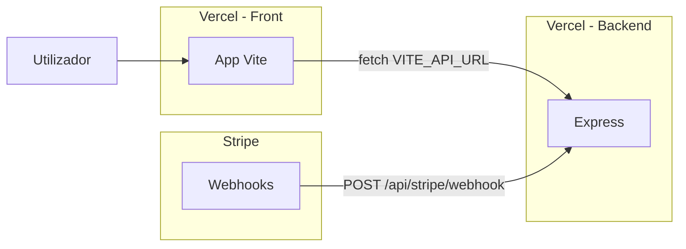

# Passo a passo: backend (API + Stripe webhook) no ar

O repositório tem **dois “produtos”**:

| Pasta | O que é | Onde costuma correr |
|--------|---------|---------------------|
| Raiz `gest-miles-usuario-front/` | Front Vite | **Projeto Vercel 1** (só HTML/JS) |
| `backend/` | Express (`/api/*`, webhook Stripe) | **Projeto Vercel 2** (API) **ou** Railway/Render/Docker |

O `.vercelignore` na raiz do front **ignora** a pasta `backend` no deploy do site — por isso a API precisa de **deploy separado** (segundo projeto na Vercel ou outro host).

### Arquitetura (dois projetos na Vercel)



---

## O que vais obter no fim

- URL pública da API `https://…………` onde:
  - `GET /api/health` → `{"ok":true,...}`
  - `POST /api/stripe/webhook` → eventos Stripe (com `STRIPE_WEBHOOK_SECRET` certo)
- No Stripe: `https://…………/api/stripe/webhook`
- No **projeto do front** na Vercel: `VITE_API_URL=https://…………` (sem barra no fim)

---

## 1) Preparar variáveis (copiar valores seguros)

No Supabase: **Project Settings → API** — `URL` e **service_role** (secreta).

No Stripe: **Developers → API keys** — `Secret key` (`sk_…`).

O `whsec_…` do webhook só depois de criares o endpoint no Stripe (passo 5).

| Variável | Obrigatório | Onde |
|----------|---------------|------|
| `SUPABASE_URL` | Sim | API |
| `SUPABASE_ANON_KEY` | Sim | API — chave **anon** (o `backend/src/lib/supabase.js` falha ao arrancar sem ela) |
| `SUPABASE_SERVICE_ROLE_KEY` | Sim | API — rotas admin / Stripe / service |
| `STRIPE_SECRET_KEY` | Sim | API |
| `PUBLIC_APP_URL` | Sim | API — URL do **front** Vercel (checkout / portal) |
| `STRIPE_WEBHOOK_SECRET` | Sim após passo 5 | API |
| `VITE_API_URL` | Sim | **Só no front** — URL base da API |

Opcional: `BREVO_*`, etc.

---

## 2) Opção A — Vercel (segundo projeto)

Usa o mesmo GitHub; crias **outro** projeto na Vercel só para a pasta `backend/`.

1. [vercel.com/new](https://vercel.com/new) → **Import** o repositório.
2. **Configure Project**:
   - **Root Directory**: `gest-miles-usuario-front/backend`  
     (se o repo for só `gest-miles-usuario-front`, usa **`backend`**).
   - **Framework Preset**: **Express** (ou *Other*; o `backend/vercel.json` fixa `framework: express`).
   - **Build Command**: `npm run build` (o script só confirma o passo; podes deixar igual ao repo).
   - **Output Directory**: **`.`** (ponto = raiz do pacote) ou deixa em branco — **não** uses `dist` (isso é para Vite). O ficheiro `vercel.json` no backend força `outputDirectory: "."` para não herdar `dist` de outro projeto.
3. **Environment Variables** (Production): `SUPABASE_URL`, **`SUPABASE_ANON_KEY`**, `SUPABASE_SERVICE_ROLE_KEY`, `STRIPE_SECRET_KEY`, `PUBLIC_APP_URL` (URL do teu front). Ainda **sem** `STRIPE_WEBHOOK_SECRET` se ainda não tens o endpoint no Stripe.
4. **Deploy**.
5. Anota o domínio gerado, ex. `https://gest-miles-api-xxx.vercel.app`.
6. Testa no browser: `https://<teu-dominio-api>/` (JSON com `service` e `health`) e `https://<teu-dominio-api>/api/health` → `ok: true`.

Se vires **500 / FUNCTION_INVOCATION_FAILED**: confirma variáveis (sobretudo `SUPABASE_*`) e vê **Logs** do deployment na Vercel; falta de módulo ou `Missing SUPABASE_URL` aparece aí.

Ficheiros relevantes no repo:

- `backend/src/index.js` — app Express com `export default app`; com `VERCEL` não chama `listen` ([Express na Vercel](https://vercel.com/docs/frameworks/backend/express)).
- `backend/vercel.json` — config mínima da Vercel.

**Local com Vercel CLI** (opcional): na pasta `backend/`, `npx vercel dev` (CLI ≥ 47).

---

## 3) Opção B — Railway

1. [railway.app](https://railway.app) → **Deploy from GitHub** → mesmo repo.
2. **Root Directory**: `gest-miles-usuario-front/backend` (ou `backend`).
3. **Variables**: mesma tabela do passo 1.
4. **Generate domain** → testa `/api/health`.

---

## 4) Opção C — Render

1. **Web Service** → repo → **Root Directory** `…/backend`.
2. **Build**: `npm install` — **Start**: `npm start`.
3. Variáveis de ambiente → testa `/api/health`.

---

## 5) Opção D — Docker (VPS / teste local)

Na pasta `backend/`:

```bash
docker build -t gest-miles-api .
docker run -p 3000:3000 --env-file .env gest-miles-api
```

Teste: `http://localhost:3000/api/health`

---

## 6) Webhook no Stripe

1. **Developers → Webhooks → Add endpoint**
2. **URL**: `https://<DOMÍNIO-DA-API>/api/stripe/webhook`  
   Exemplo Vercel: `https://gest-miles-api-xxx.vercel.app/api/stripe/webhook`
3. Eventos: `checkout.session.completed`, `customer.subscription.updated`, `customer.subscription.deleted`, `invoice.payment_succeeded`, `invoice.payment_failed`
4. Guarda → copia **Signing secret** `whsec_…`
5. Nas variáveis do **projeto da API** (Vercel/Railway/…): `STRIPE_WEBHOOK_SECRET=whsec_…`
6. **Redeploy** a API.
7. Teste **Send test webhook** no Stripe e confirma **200** nos logs.

**Importante:** `STRIPE_SECRET_KEY` e `STRIPE_WEBHOOK_SECRET` no projeto **só do front** na Vercel **não** executam o webhook — têm de estar no **projeto onde corre o Express** (ou remover do front para evitar confusão).

---

## 7) Ligar o front (projeto Vercel do site)

No projeto **`gest-miles-usuario-front`** (front) → **Settings → Environment Variables**:

- `VITE_API_URL` = `https://<DOMÍNIO-DA-API>` — sem `/` final.

**Redeploy** o front.

---

## 8) Painel Admin e Stripe publishable

- **Admin** (`gest-miles-admin-front`): `VITE_API_URL` = mesma base da API.
- **Front utilizador**: `VITE_PUBLIC_STRIPE_PUBLISHABLE_KEY` = `pk_…` (só no front).

---

## Checklist

- [ ] `GET https://<api>/api/health` → `ok: true`
- [ ] Stripe webhook → `https://<api>/api/stripe/webhook` com respostas 200
- [ ] `STRIPE_WEBHOOK_SECRET` no **deploy da API**
- [ ] `VITE_API_URL` no **deploy do front** + redeploy
- [ ] `PUBLIC_APP_URL` na API = URL do front

---

## Problemas frequentes

| Sintoma | Causa provável |
|---------|----------------|
| Webhook 404 | URL do **front** em vez da **API**; ou path errado |
| Webhook 400 signature | `whsec` errado ou variável só no projeto do front |
| API 404 na Vercel | Root Directory não é `backend/`; ou deploy do repo errado |
| Build remove `/backend/package.json` | `.vercelignore` na **raiz** do repo não pode conter `backend` — esse ficheiro aplica-se a todos os projetos Vercel do mesmo repo |
| `Missing script: "build"` | O `backend/package.json` inclui `npm run build` (passo vazio); na Vercel deixa **Build Command** por defeito ou `npm run build` |
| `No entrypoint found in output directory: "dist"` | O preset do projeto estava como front (Vite): **Output Directory** deve ser **`.`** ou vazio, não `dist`. O `backend/vercel.json` define `outputDirectory: "."` e `framework: express` |
| Front não chama API | `VITE_API_URL` em falta / redeploy |

Mais detalhes Stripe: [stripe_setup.md](./stripe_setup.md).
